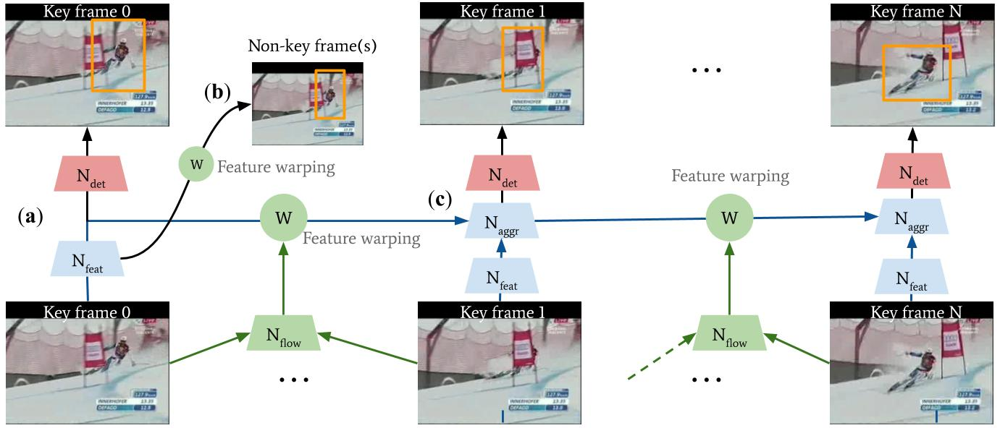
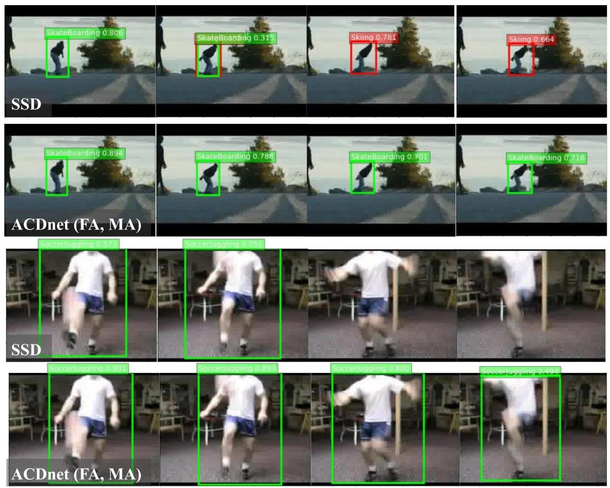

# ACDnet

## What is ACDnet?

ACDnet is Action Detection network for real-time edge computing based on flow-guided feature approximation and memory aggregation.

ACDnet has been submitted to Pattern Recognition Letters in July 2020 and a revised manuscript has been sent in dec 2020.

Y. Liu, F. Yang, and D. Ginhac, “ACDnet: An Action Detection network for real-time edge computing based on flow-guided feature approximation and memory aggregation”, Submitted to Pattern Recognition Letters, Special Issue on Advances on Human Action, Activity and Gesture Recognition (AHAAGR)

## Download code
For reproducibility purpose, codes will be available soon.

## Abstract 
Interpreting human actions requires understanding the spatial and temporal context of the scenes. State-of-the-art action detectors based on Convolutional Neural Network (CNN) have demonstrated remarkable results by adopting two-stream or 3D CNN architectures. However, these methods typically operate in a non-real-time, offline fashion due to system complexity to reason spatio-temporal information. Consequently, their high computational cost is not compliant with emerging real-world scenarios such as service robots or public surveillance where detection needs to take place at resource-limited edge devices. 

In this paper submitted to Pattern Recognition Letters, we propose ACDnet, a compact action detection network targeting real-time edge computing which addresses both efficiency and accuracy. It intelligently exploits the temporal coherence between successive video frames to approximate their CNN features rather than naively extracting them. It also integrates memory feature aggregation from past video frames to enhance current detection stability, implicitly modeling long temporal cues over time.

To the best of our knowledge, this is the first attempt applying feature approximation and aggregation techniques to achieve efficient action detection which can benefit resource-limited devices. To summarize, our contribution is three-fold:

1. We propose an integrated detection framework, ACDnet, to address both detection efficiency and accuracy. It combines feature approximation and memory aggregation modules, leading to improvement in both aspects. 

2. Our generalized framework allows for smooth integration with state-of-the-art detectors. When incorporated with SSD (single shot-detector), ACDnet could reason spatio-temporal context well over real-time, more appealing to resource-constrained devices.

3. We conduct detailed studies in terms of accuracy, efficiency, robustness and qualitative analysis on public action datasets UCF-24 and JHMDB-21.

Experiments conducted on the public benchmark datasets UCF-24 and JHMDB-21 demonstrate that ACDnet, when integrated with the SSD detector, can robustly achieve detection well above real-time (75 FPS). At the same time, it retains reasonable accuracy (70.92 and 49.53 frame mAP) compared to other top-performing methods using far heavier configurations. 

